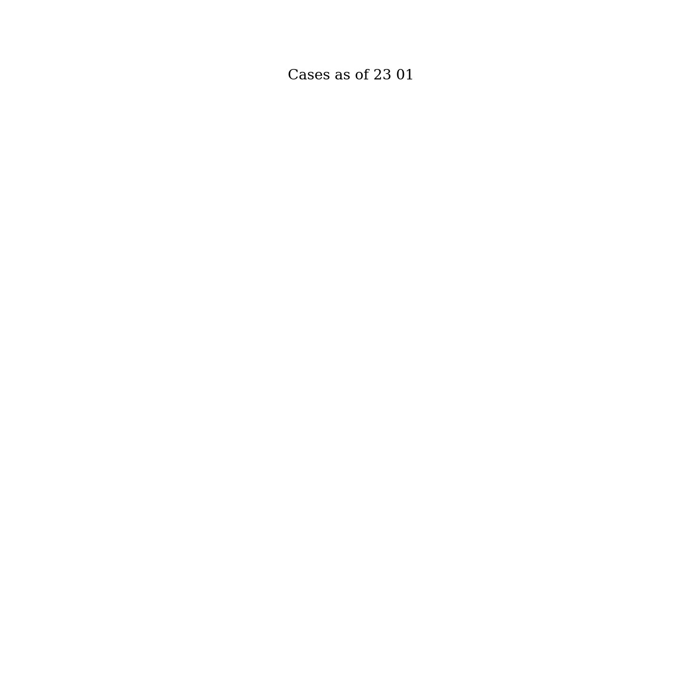

# CITS4403 Computational Modelling - Group Project
### Jayden Kur, 21988713
### Roarke Holland, 21742366
### Andrew Ha, 22246801
# COVID-19 
This project aimed to visualize the COVID-19 spread over a given period of time, in South Korea.
The notebook displays through graphs, the infections per city, per gender and deaths.
It also displays statistical measures such as daily growth and cases growth over time per city
Some results are shown below
### A gif displaying the increase of cases 
### 
### Display of males/females by colour and cases
### 
### Graph of cases by date in a given city
### 
